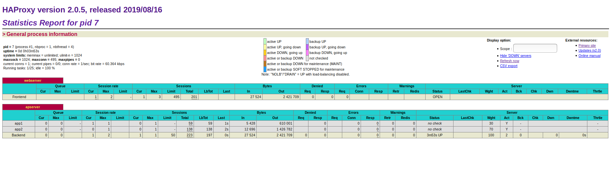

# Project documentation
We are going to use docker-compose just for the simplicity.
Beside running our webservers, I decided to implement [HAProxy](https://www.haproxy.org/) as one of the quick quick solutiona to loadbalance traffic.
My decision to use HAProxy was simply because I had experience working with it and it can be quickly used with docker compose setup.

In order to start the setup please run in the root directory:
`docker-compose up --build`

Docker files with binaries for golang and java webserver resides in directories `go` and `java` while for HAProxy in `haproxy`.

Docker images have to be build in the directories mention above by running:

`docker build -t golang-webserver:v1 .` - in the go directory  
`docker build -t java-webserver:v1 .` - in the java directory

or docker-compose.yml can be change to build those images the way how it is set for HAProxy image.

## Java app test
This is quick test 
This is quick test after running the image `docker run -p 8080:8080 bratislav/java-webserver:v1` by running
`curl -vs "http://localhost:8080/hotels"` to check if endpoints reacts to requests. Of course tests can and should be be automated

## Go app test
This is quick test after running the image `docker run -p 8080:8080 bratislav/golang-webserver:v1` by running
`curl -vs "http://localhost:8080/hotels"` to check if endpoints reacts to requests.

## HAProxy
We will be using roundrobin with `weight` parameter in HAProxy configuration (haproxy.cfg) in order to balance traffic coming to backends.

Regarding using weight to load balance the traffic with HAProxy:
http://cbonte.github.io/haproxy-dconv/configuration-1.4.html#5-weight

There we can read:
`From haproxy config. The "weight" parameter is used to adjust the server's weight relative to other servers. 
All servers will receive a load proportional to their weight relative to the sum of all weights, so the higher the weight, 
the higher the load. The default weight is 1, and the maximal value is 256.`

The suggestion for weight parameter is:
`If this parameter is used to distribute the load
according to server's capacity, it is recommended to start with values which
can both grow and shrink, for instance between 10 and 100 to leave enough
room above and below for later adjustments.
`
### HAProxy stats
Stats can be seen at `http://localhost:8000/haproxy?stats` authenticating with admin:admin

### Testing
After quick manual testing sending certain number of requests by using `watch -n `curl -vs "http://localhost:8000/hotels"`` we could check HAProxy stats page to check
if traffic will be balanced by weight ratio 70:30 as we used it in the HAProxy config file. Using `watch` command helped us to follow evolution of the sessions distribution
so that we will be able to check if session distribution ration remains through time.

We used 70:30 for the sake of simplicity and accepting suggestion for the weight parameter so that if we add more backend servers we can adjust values and load.

 is the snapshot of the stats page. We can see that session distribution toward app1 and app2 servers is 15 versus 38 (Sessions Total).
So `38/53=0.716...` that is pretty close to 70%.

After passing some time distribution remained the same . 

NOTE: Regarding HAProxy configuration, it was the simplest setup just for the purpose of demonstrating quick solution.